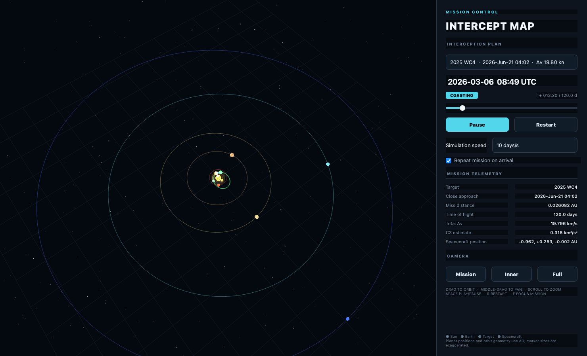

# Asteroid Intercept Planner

A desktop application and automated data pipeline for exploring upcoming asteroid close approaches and sizing preliminary Earth-to-asteroid transfers.

The project combines live [JPL Small-Body Database](https://ssd-api.jpl.nasa.gov/doc/sbdb.html) and [Close-Approach Data](https://ssd-api.jpl.nasa.gov/doc/cad.html) with normalized SQLite storage, a searchable Flask dashboard, and an interactive OpenGL solar-system map. A scheduled GitHub Actions workflow refreshes the database four times per day.

> This is a research and portfolio project, not an operational navigation product.

## What it does

- Discovers upcoming Earth close approaches through JPL CAD.
- Retrieves osculating orbital elements from JPL SBDB.
- Searches configurable departure and arrival grids.
- Solves the heliocentric, single-revolution Lambert problem.
- Rejects solutions that fail an endpoint propagation check.
- Stores encounters, elements, ingestion history, and transfer plans in SQLite.
- Presents the catalog through a dark, responsive web dashboard.
- Provides a read-only SQL explorer, CSV export, and JSON API.
- Exports time-sampled 3D transfer trajectories into an interactive mission viewer.
- Propagates all eight planets and the selected asteroid against the simulation date.
- Supports mission selection, timeline scrubbing, repeat playback, speed control, and map-style camera navigation.
- Launches ingestion, the dashboard, and the viewer from one desktop window.

## Architecture

```text
JPL CAD ── close approaches ─┐
                            ├─> ingestion ─> SQLite ─┬─> Flask dashboard / API
JPL SBDB ─ orbital elements ┘                        ├─> read-only SQL / CSV
                                                     └─> JSON export ─> Qt viewer
```

The database is the source of truth. JSON is now only a portable viewer export; the pipeline no longer uses a collection of competing JSON snapshots.

## Quick start

Python 3.11 or later is required.

```bash
python -m venv .venv
source .venv/bin/activate        # Windows: .venv\Scripts\activate
python -m pip install -e ".[desktop]"
cp .env.example .env
python run.py
```

The launchpad provides three actions:

1. **Update from JPL** fetches data, computes transfers, and updates SQLite.
2. **Launch dashboard** starts the local Flask application and opens it in a browser.
3. **Launch viewer** exports the latest database plans and opens the 3D mission map.

## 3D mission viewer

The viewer is modeled after a spaceflight map screen rather than a decorative animation. Distances and orbital geometry share one astronomical-unit scale; only marker sizes are exaggerated so planets remain visible.



- Select any stored interception from the side panel.
- Watch the date, elapsed mission time, spacecraft coordinates, Δv, C3, and encounter metrics.
- Drag to orbit the camera, middle-drag to pan, and use the wheel to zoom.
- Switch between mission, inner-system, and full-system camera presets.
- Scrub to any mission time or play continuously at 0.5-100 simulated days per second.
- Leave repeat enabled to restart automatically on arrival.
- Use `Space` for play/pause, `R` to restart, and `F` to focus the selected mission.

Planet states use JPL's approximate J2000 elements and secular rates. Earth uses the same configured analytic or Skyfield ephemeris as the transfer planner. The selected asteroid is propagated from its SBDB osculating elements, and the spacecraft follows the validated, time-uniform 3D Lambert trajectory.

Individual components can also be run directly:

```bash
python -m app.ingest --print-json
python -m app.web
python -m app.neo_viewer_qt data/latest_intercepts.json
```

## Configuration

All operational settings live in `.env`; `.env.example` documents every supported value.

| Variable | Default | Purpose |
|---|---:|---|
| `ASTEROID_DATABASE_PATH` | `data/asteroids.db` | SQLite source of truth |
| `ASTEROID_VIEWER_EXPORT_PATH` | `data/latest_intercepts.json` | Generated viewer payload |
| `JPL_DATE_MIN` / `JPL_DATE_MAX` | `now` / `+60` | Close-approach window |
| `JPL_DISTANCE_MAX_AU` | `0.05` | Maximum encounter distance |
| `JPL_RESULT_LIMIT` | `2000` | CAD response limit |
| `INTERCEPT_TOF_MIN_DAYS` | `30` | Minimum time of flight |
| `INTERCEPT_TOF_MAX_DAYS` | `180` | Maximum time of flight |
| `INTERCEPT_TOF_STEP_DAYS` | `10` | Search-grid spacing |
| `INTERCEPT_ARRIVAL_OFFSETS_HOURS` | `-12,-6,0,6,12` | Arrival offsets around closest approach |
| `LEO_ALTITUDE_KM` | `500` | Parking orbit for approximate injection Δv |
| `EPHEMERIS_MODE` | `analytic` | Deterministic Earth model or `skyfield` |
| `JPL_EPHEMERIS_PATH` | empty | Optional local JPL DE kernel |
| `FLASK_HOST` / `FLASK_PORT` | `127.0.0.1` / `5000` | Local dashboard address |

No API key is required for the JPL SSD endpoints used by this project. `.env` is ignored by Git.

## Data model

The normalized database contains:

- `asteroids`: stable object identity and physical properties.
- `orbital_elements`: the latest SBDB osculating solution.
- `close_approaches`: time, distance, velocity, and uncertainty for each encounter.
- `intercept_plans`: transfer timing, Δv, C3 approximation, and viewer polyline.
- `ingestion_runs`: query, status, counts, and errors for every attempted refresh.
- `latest_asteroid_summary`: dashboard-oriented view joining the latest records.

Imports use a single immediate transaction and idempotent upserts. Foreign keys and uniqueness constraints prevent partial or duplicate encounter records.

## Automated updates

`.github/workflows/asteroid-data.yml` runs tests and linting on pushes and pull requests. On its six-hour schedule—or through manual dispatch—it then:

1. fetches CAD and SBDB data;
2. computes transfer plans;
3. updates `data/asteroids.db` transactionally;
4. runs SQLite's integrity check; and
5. commits the database only when its contents changed.

The generated viewer JSON and API caches are deliberately not committed.

## Mathematical model

The planner uses osculating two-body elements in the ecliptic J2000 frame and a universal-variable Lambert solver. Every accepted Lambert solution is independently propagated to the requested arrival epoch and must satisfy an endpoint residual threshold.

See [docs/math.md](docs/math.md) for the derivation, frames, assumptions, validation strategy, and interpretation of Δv/C3 values.

## Development

```bash
python -m pip install -e ".[dev]"
pytest
ruff format --check app scripts/orbital.py scripts/ephem_earth.py \
  scripts/hud_metrics.py scripts/plan_intercepts.py scripts/sbdb_client.py tests run.py
ruff check app scripts/orbital.py scripts/ephem_earth.py \
  scripts/hud_metrics.py scripts/plan_intercepts.py scripts/sbdb_client.py tests run.py
```

Tests cover database idempotency, read-only SQL enforcement, Flask routes, planetary propagation, 3D mission loading, Kepler propagation, and Lambert endpoint closure.

## Scope and limitations

- Transfers are heliocentric, impulsive, two-body, and single-revolution.
- The search is a configurable grid, not a continuous global optimizer.
- The default Earth state is a deterministic low-precision J2000 Kepler model.
- `EPHEMERIS_MODE=skyfield` provides an optional JPL DE Earth state.
- Asteroid elements are osculating and are not numerically integrated with perturbations.
- C3 and LEO departure Δv are preliminary patched-conic estimates.
- No launch vehicle, finite-burn, capture, navigation, or uncertainty design is performed.

## License

MIT
